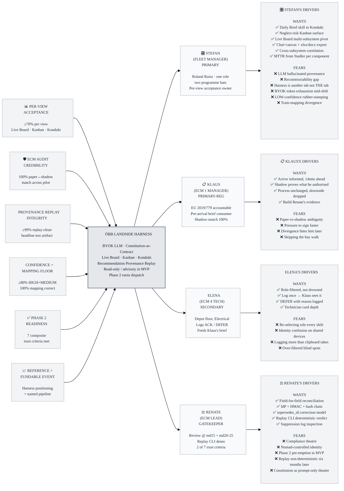

# Trigger Map Poster: ÖBB Landside Platform

> Visual overview connecting business goals to user psychology

**Created:** 2026-05-25
**Revised:** 2026-05-25 (harness-model reframe — Lukas persona retired, business objectives recomputed, drivers re-aligned to three views)
**Author:** Abbas Rizvi
**Methodology:** Based on Effect Mapping (Balic & Domingues), adapted for WDS framework

---

## Strategic Documents

This is the visual overview. For detailed documentation, see:

- [`personas/01-disponent-stefan.md`](personas/01-disponent-stefan.md) — Fleet Manager (Roland = Roland Ruisz, one role, two programme hats — pending revision)
- [`personas/02-ecm-manager-klaus.md`](personas/02-ecm-manager-klaus.md) — ECM 1 Manager
- [`personas/03-ecm-4-technician-elena.md`](personas/03-ecm-4-technician-elena.md) — ECM 4 Technician
- [`personas/04-telematik-lukas.md`](personas/04-telematik-lukas.md) — **Retired** as separate persona on 2026-05-25 (drivers merged into Roland; file archived)
- [`personas/05-ecm-lead-renate.md`](personas/05-ecm-lead-renate.md) — ECM Lead (commercial gatekeeper)
- [`feature-impact-analysis.md`](feature-impact-analysis.md) — feature → driver mapping with impact scores

---

## Vision

**The platform is a landside fleet management harness for an operator-provided LLM, exposing live multi-subsystem train telemetry through a constitution + skills + MCP scaffolding — producing daily briefs, kanban triage, live-board diagnostics, and recommendation artifacts that earn the right to dispatch.**

ÖBB Flottenmanagement plugs in their LLM API key (BYOK). The harness brings the constitution, the skills, the Rail MCP server, the PostgreSQL+pgvector data layer, the audit trail, the Recommendation Provenance Replay archive, and the allowlisted internet egress. The constitution is *enforced as contract* — per-skill schemas + provenance validators + advisory-language linter validate every LLM emission before it reaches the operator. Failed validations suppress (no regeneration loop in MVP — *silence is safe*).

In MVP the harness closes the *information* gap across three views (Live Board / Kanban / Kondukt) plus depot recommendation-consumer surfaces. The 6-month pilot earns the seven composite trust criteria. Phase 2 closes the *execution* gap — platform-mediated dispatch, authoritative ECM record — gated on that earned trust.

---

## Business Objectives

### Objective 1: Demonstrate harness adoption across the Fleet Manager's full work

- **Metric:** Recommendation acceptance rate per view (Live Board annotations / Kanban lane proposals / Kondukt skill invocations / Kondukt free-form chats) — measured separately, not aggregated, to prevent survivorship bias (Saga's party-mode caution)
- **Target:** ≥70% per-view acceptance within first 30 pilot mandays (Roland-confirmed working assumption)
- **Timeline:** Per-view acceptance updated weekly; one of the seven Phase 2 trust criteria

### Objective 2: Establish ECM audit-trail credibility as Phase 2 evidence

- **Metric:** Shadow audit-trail match rate against paper sign-off (field-for-field), reconciled 1:1 with the Recommendation Provenance Replay archive
- **Target:** 100% shadow-match across the full pilot; ≤2 divergences per pilot week before Phase 2 readiness downgrades
- **Timeline:** From pilot manday 1; Renate Fischer review at manday 15 (with Replay CLI demo); outside-auditor tabletop at mandays 20–25

### Objective 3: Prove constitution-as-contract enforcement at pilot scale

- **Metric:** Recommendation Provenance Replay archive integrity — replay-verify-clean rate, recommendations-without-triplet count, advisory-only language linter breaches
- **Target:** ≥99% replay-verify clean; 0 recommendations without triplets; 0 advisory-only language breaches across the full pilot
- **Timeline:** Continuous through pilot; demonstrated live at manday ~15 (Dr. Fischer) and manday 20–25 (outside-auditor tabletop). This is the headline pilot test artifact.

### Objective 4: Confidence and data-integrity floor

- **Metric (a):** High-confidence inference rate — HIGH+MEDIUM share of emissions; LOW-confidence rate sustained over any 72h window
- **Target (a):** ≥80% HIGH+MEDIUM (working assumption, Roland-confirmed pre-pilot); LOW-rate <15% sustained
- **Metric (b):** Train-to-landside-DB mapping correctness — weekly automated reconciliation between IntentPacket `train_id` and MQTT topic + component MAC/IP registry validation
- **Target (b):** 100% across the full pilot; zero misroutes tolerated
- **Timeline:** Continuous through pilot; mapping correctness is a pilot-kill trigger (any divergence halts harness data writes for the affected train)

### Objective 5: Cross the seven-criteria Phase 2 readiness composite

- **Metric:** Composite of (a) per-view acceptance ≥ threshold AND (b) shadow-match 100% AND (c) Replay archive ≥99% clean AND (d) high-confidence rate ≥80% AND (e) train-mapping 100% AND (f) Renate Fischer sign-off AND (g) outside-auditor tabletop verdict + zero unresolved pilot-kill triggers in final 30 days
- **Target:** All seven required for full Phase 2 release; partial satisfaction triggers narrower Phase 2 scope per §7 Claim 5 of the PRD
- **Timeline:** Phase 2 readiness recommendation within 6 months of pilot manday 1 (Feb/Mar 2027)

### Objective 6: Reference customer + fundable event

- **Metric:** Roland + Martin + Renate written endorsement; the Replay archive integrity demonstrated externally; named pipeline
- **Target:** Speedinvest / i5invest first-meeting-ready package by pilot end. The **harness as the product** (BYOK + constitution-as-contract + Provenance Replay) — not warranty arbitrage — carries the commercial argument.
- **Timeline:** Pilot manday 24 / Q1 2027

---

## Target Groups (Prioritized)

### 1. Roland the Fleet Manager — **Primary**

**Priority Reasoning:** Highest-frequency user, the persona whose per-view acceptance rate gates Phase 2, and the one carrying the operational evidence the harness produces. Daily 12-hour shifts. Roland Ruisz, DI(FH) — Flottenmanagement / System- und Betriebstechnik / Team Telematik / Teil-Projektleitung Telematik for Cityjet DOSTO Neu + Enzo. **One role, two programme hats** — not two personas. The previous "Lukas" persona is retired; his programme-management work is one of Roland's contexts, not a distinct persona. (Previously pseudonymous as "Stefan" — renamed 2026-05-25 to use the real first name directly.)

> Roland runs a 12-hour rotating shift across operations + new-fleet commissioning. He's solution-focused, stress-resilient, accountable for fleet availability + technical telematics layer health. He's already monitor-heavy and digitally fluent — but switches between 4–7 systems (vendor portals, Nomad Monitoring, Power BI, ServiceNow, MS Project, Excel, paper) where decisions get slow and traceability gets thin. The Nomad Monitoring System gives him IoB visibility only; CCTV, PIS, intercoms, AFZ, audio, Wi-Fi, switches, TCMS, Stadler diagnostic — no unified view.

**Key Positive Drivers:**

- Open the harness in the morning, invoke the *Daily Brief* skill in Kondukt, get a validated overnight situation report with provenance — first-kill decision in 4 minutes
- Triage open faults via the Neglect-Risk Kanban — "which incident is decaying without attention" not "which arrived most recently"
- Live Board: fleet-wide moving map + per-subsystem health (CCTV, PIS, intercoms, AFZ, audio, Wi-Fi, switches, TCMS, Stadler diagnostic) — group-pivot by subsystem OR by train — multi-subsystem visibility no competitor produces
- Kondukt skills (Daily Brief, Recurring-failure pattern, Vendor meeting prep, Fleet health summary) + free-form chat + allowlisted internet egress + xlsx/docx artifact download — the agentic-OS surface that turns his LLM into a fleet co-pilot
- Lightweight recommendation interactions (accept / modify / reject / mark seen) — no deliberate-confirmation gestures in MVP (Mark-executed gesture descoped 2026-05-25)
- Cross-subsystem correlation surfaced by Kondukt — intercom drops + CCTV drops + Wi-Fi AP drops on the same train in the same window = network-path issue, not three independent failures
- MTTR computed by harness from landside-observed timestamps (`t_close − t_open` of Stadler alarm IntentPackets), surfaced per component
- Time-since-fault per component; depot-train visibility alongside in-service trains

**Key Negative Drivers:**

- Recommend something Kondukt cited that turned out to be wrong because the LLM hallucinated provenance — but with the constitution-as-contract layer, this is suppressed at emission time (silence is safe)
- Get pulled into a regulatory dispute because his execution trail couldn't reconstruct who decided what — Provenance Replay archive answers this
- A "co-pilot" that turns out to be a slower way to do what he already does in HAFAS / Power BI / vendor portals — the harness must be the *one* surface he opens, not another tab in the rotation
- BYOK token budget exhaustion mid-shift — the customer's LLM provider returns 429, Kondukt skills suppressed, fallback to Live Board + Kanban telemetry only
- LOW-confidence recommendations rubber-stamped under time pressure — the LOW-confidence DISABLE rule + modification_distance capture is locked, but the rate of LOW emissions itself must stay under 15% sustained or the calibration is broken
- Train-to-landside-DB mapping divergence — silent misrouting (a recommendation cites "fault on train 4736-101" but the underlying IntentPacket came from train 4736-103) destroys the trust premise

---

### 2. Klaus the ECM 1 Manager — **Primary (regulatory)**

**Priority Reasoning:** The persona whose process is *not* changed in MVP but whose audit trail is the Phase 2 commercial wedge. Owns the pre-arrival review rate (>80% target) and the shadow-match rate (100% target).

> Klaus is accountable under EU Directive 2019/779. He arrives cold to a depot and his liability begins the moment he signs. Before the harness he asked the technician, read the paper fault log, made a judgment call, signed paper. The harness doesn't replace any of that — it gives him a structured brief 14 minutes before the vehicle docks and shadows his sign-off.

**Key Positive Drivers:**

- Arrive at the bay already knowing what failed, who resolved it, and what was deferred (with provenance citations to IntentPackets)
- Have a digital shadow that proves what he actually authorised, if the paper is ever disputed
- Be the persona whose process didn't change but whose downside risk dropped
- Build the 100% shadow-match evidence that lets Renate sign off Phase 2

**Key Negative Drivers:**

- A digital sign-off that competes with the paper sign-off for "which is authoritative" — process ambiguity at the moment of regulatory clearance
- A harness that, by being present, gets him asked to sign off faster than he's comfortable
- A shadow record that says one thing while the paper says another, and the divergence comes back at him later
- Any pressure (real or perceived) to skip walking to the bay and confirming with the technician on site

---

### 3. Elena the ECM 4 Technician — **Secondary (operational)**

**Priority Reasoning:** Acknowledgement loop closer. Without Elena (and her Electrical / Mechanical / IT peers) logging resolutions, Klaus's pre-arrival brief is empty.

> Elena is on the depot floor — Electrical specialism. She fits parts, runs tests, deals with vendor portals when SNMP traps fire. Her current "logging" is a clipboard sheet and a phone call to whoever's covering ECM 1. She's used to her tools; she doesn't want a new screen unless it cuts steps.

**Key Positive Drivers:**

- A role-filtered view that doesn't drown her in brake alerts when she's working a camera firmware ticket
- Log an ACK once and have it propagate to Klaus's brief automatically — no phone call
- Defer something with a reason logged, instead of "yeah I told someone"
- Card depth tuned to her — fault code, port, last-known-good state, diagnostic step — not executive plain English

**Key Negative Drivers:**

- A shared depot device where she has to re-select her role every shift (friction → adoption drops)
- Being held accountable for an ACK she didn't make (identity confusion on shared devices)
- A harness that asks her to log structured detail she'd otherwise scribble on a clipboard in 3 seconds
- Card visibility rules that hide something she needed to see (over-filtered → blind spot)

---

### 4. Renate the ECM Lead (Head of Vehicle Maintenance, ÖBB TS) — **Commercial Gatekeeper**

**Priority Reasoning:** Not a daily user — a key reviewer at pilot manday 15 + manday 20–25 (outside-auditor tabletop). Her endorsement is **two** of the seven Phase 2 trust criteria (criterion 6 — qualitative sign-off; criterion 3 — Replay archive integrity is the artifact she signs off on). Without her, Phase 2 narrows or doesn't happen.

> Renate is the ECM-accountable executive. She was not in the pilot planning meeting. Martin Lerch brings her in. Her question is not "does it work?" — it's "is this audit-trail capability sound enough that I would be willing, after pilot end, to make it the authoritative ECM record? And is the harness's recommendation infrastructure trustworthy enough that I'd let it dispatch?"

**Key Positive Drivers:**

- Field-for-field paper-to-shadow reconciliation she can verify with her own eyes on Unit 4722
- IdP-bound identity, HMAC + hash-chain tamper evidence, append-only enforcement at DB level — engineering rigour she can stake her name on
- A clear correction model (`supersedes_id`) that doesn't mutate the past
- A divergence-handling story she can present to her audit committee
- **The Replay CLI demonstrated live on her laptop** — she picks any recommendation at random from the harness archive; the CLI re-runs the validator against the stored Provenance Bundle; verdict deterministic, no LLM in the loop. *"Wenn ich das in einem halben Jahr nochmal mache, läuft es genauso?"* — yes.
- The Validation Receipt suppression log — proof that the harness rejected recommendations that didn't meet the constitution, not just emitted recommendations

**Key Negative Drivers:**

- A platform that *looks* compliant but ducks the supersedes / correction question
- Audit trail tied to a Nomad-controlled identity rather than ÖBB's IdP (sovereignty concern)
- Any pre-emption of Phase 2 in MVP scope — anything that smells like "we're already the record of authority, you just haven't noticed"
- Export format that her documentation system can't ingest at fleet rollout
- A Recommendation Provenance Replay archive that does not reproduce deterministically six months later (existential bug — invalidates everything)
- Constitution-as-contract that turns out to be prompt-only theatre rather than enforced post-processing

---

## Trigger Map Visualization

---

## Design Focus Statement

**The MVP succeeds when Roland's per-view acceptance crosses ≥70% on all three views (Live Board annotations, Kanban lane proposals, Kondukt skill invocations), the Recommendation Provenance Replay archive holds ≥99% replay-verify clean, Klaus's shadow record matches his paper every time, and Renate signs off on both the audit trail and the Replay archive.** Everything else — Elena's ACK loop, the fundable-event narrative — is downstream of these four signals. Design every surface to earn them.

**Primary Design Target:** Roland (Fleet Manager) — highest-frequency user, per-view acceptance owner, harness USP carrier.

**Must Address (no design choice may regress these):**

- Three views, not four: Live Board (glanceable, click-through redirects to Kanban), Kanban (depth surface with progressive disclosure), Kondukt (skill registry + free-form chat)
- Daily Brief is a Kondukt skill, not a separate view
- No VLAN IDs on Live Board; VLAN + IP + MAC + firmware + switch port live on the Kanban detail card
- Kanban detail card uses progressive disclosure — primary on expansion, secondary on click (MTTR / recurring-failure history / 24h packet trace / vendor portal deep-link)
- Pre-arrival brief opens 14 minutes before HAFAS scheduled arrival, role-filtered, no role hidden by accident (Klaus + Elena)
- ECM shadow sign-off via simple click in MVP — deliberate-confirmation gestures (hold-to-record, Mark-executed) descoped from MVP 2026-05-25. Hold-to-record preserved in design-system reference as Phase 2 candidate.
- IdP-bound identity, HMAC, hash chain, `supersedes_id` correction visible in audit export (Renate)
- Divergence between paper and shadow surfaces within 24h, never silently ignored (Renate)
- Constitution-as-contract enforcement on every Kondukt emission — schema + provenance validator + advisory-language linter; failed validations suppress (silence is safe)
- Recommendation Provenance Replay triplet (Envelope + Provenance Bundle + Validation Receipt) on every emission; Replay CLI runs deterministically on auditor's laptop
- LOW-confidence DISABLE rule (party-mode 2026-05-25 lock) + modification_distance capture
- Confidence pill on every Kondukt emission (HIGH/MEDIUM/LOW)
- BYOK key handling: encrypted at rest, per-user scope, never logged, token usage transparent to operator
- Allowlisted internet egress — curated approved-domains list; every fetch logged
- Train-to-landside-DB mapping integrity — weekly reconciliation, zero misroutes

**Should Address (high value, no first-MVP blocker):**

- Cross-subsystem correlation surfacing in Live Board annotations + Kondukt recurring-failure skill
- Role persistence model split: session-only on shared depot device, stored on personal phone (Elena)
- Per-fetch logging surface on allowlisted egress (so the operator can audit what Kondukt fetched)
- Suppression-log inspection surface (so Renate can see what the validator rejected and why)

---

## Cross-Group Patterns

### Shared Drivers

- **All four personas fear the platform overstating its authority** — Roland fears LLM-hallucinated provenance, Klaus fears paper-vs-shadow ambiguity, Renate fears Phase 2 pre-emption or constitution-as-theatre, Elena fears being held accountable for an ACK she didn't make. **Implication:** advisory-only must be visible in the UI grammar AND enforced by the validator, not just stated in the PRD. The harness's voice is "I propose, you decide, I record — and the validator stops me from speaking out of turn."
- **All four operational personas want continuity with the systems they already trust** — HAFAS for Roland, paper for Klaus, clipboard ergonomics for Elena, raw vendor portals for everyone. **Implication:** the harness layers on top, doesn't displace. Every workflow must answer "what do I do in the system I trust?" — that's the step-by-step in the recommendation artifact + the vendor portal deep-link in the Kanban detail card.
- **All four want traceability, not just records** — every persona's negative driver includes some version of "and then it comes back at me." **Implication:** every audit surface answers *who decided, when, what action, what outcome* — not just "an event happened." The Provenance Replay archive answers this for harness-side recommendations; the shadow audit trail answers it for operator-side actions; the two reconcile 1:1.

### Unique Drivers

- **Roland:** the only persona whose acceptance behaviour is a *measured composite per-view* (Live Board / Kanban / Kondukt skills / Kondukt free-form chat), and whose modification rate signals trust-but-not-yet-dispatch. Modification UX matters as much as accept UX. Roland also carries the cross-subsystem-correlation work that no competitor can match.
- **Klaus:** the only persona whose process *doesn't change* in MVP. Surfaces must not pressure him to sign faster than his paper process supports.
- **Elena:** the only persona working on a shared device in some contexts and a personal device in others. Identity model must support both without confusion.
- **Renate:** the only "persona" who is a one-time + tabletop reviewer, not a daily user. Her surface is the audit export, the reconciliation queue, AND the Replay CLI demo — three things she handles in sequence at manday ~15 and manday 20–25.

### Potential Tensions

- **Roland ↔ Renate** — Roland wants the harness to feel like a co-pilot accelerating his decision; Renate wants it to feel like a record-keeper that has not yet earned authority. **Resolution:** every Kondukt emission Roland sees has already passed through the constitution-as-contract validator (Renate's safety guarantee); every operator action Roland takes writes a shadow audit row Renate audits later. The same surface satisfies both readings — proposal for Roland, validated-and-recorded for Renate.
- **Klaus ↔ Roland** — Klaus's process is paper-first; Roland's is harness-first. Both write into shadow records (Klaus via the ECM sign-off click in the Depot PWA; Roland via recommendation accept/modify/reject interactions on Kanban + Kondukt cards). Schema makes the source explicit (`source: ecm_signoff` vs `source: recommendation_action`) so Renate's reconciliation queue audits each correctly. (Note: deliberate-confirmation gestures descoped from MVP 2026-05-25.)
- **Elena ↔ Klaus** — Elena's role-filtered view hides things by design (the brake alert isn't shown to IT). Klaus's view shows everything. If a fault is mis-tagged for `role_relevance`, Elena is blind and Klaus is overwhelmed. **Resolution:** the `role_relevance` field on cards needs an ECM-Manager-signed-off taxonomy (pre-pilot blocker — see FIA risk watchlist).
- **Roland's "Day in the Harness" ↔ MVP simplicity** — Roland opens Kondukt + uses Daily Brief skill + invokes Vendor meeting prep skill in one session. That's a lot of skills shipping in v1. **Resolution:** versioned skill registry per FR13 — MVP ships with the four named skills (Daily Brief, Recurring-failure pattern, Vendor meeting prep, Fleet health summary); additions during pilot are versioned ADRs, not surface rewrites.

---

## What's Cut from the Previous Trigger Map

Logged for traceability (2026-05-25 harness reframe + party-mode + operator correction):

| Cut | Reason | Where it lives now |
|---|---|---|
| **Objective 4 — Warranty leverage commercial wedge** | Warranty recovery workflow descoped from MVP; harness positioning itself carries the commercial argument | Vision tier; harness *detection* capability surfaces via Live Board recurring-failure + Kondukt Vendor meeting prep skill |
| **Lukas as separate persona** (was #4 in the previous list) | Same role as Roland; one person, two programme hats. Persona file archived. | Drivers merged into Roland; archived `personas/04-telematik-lukas.md` retained for traceability |
| **Prevented delay-minutes counterfactual as primary ROI metric** | Pre-pilot we have no baseline euro figures; committing pre-pilot would be making numbers up | Kept as qualitative outcome for post-pilot ROI narrative, not as a pilot pass criterion (operator correction post-party-mode) |
| **Three surfaces** (Fleet Manager AI Interface + Depot Briefing PWA + Telematics Control Board as separate products) | Collapses into one harness (three views) + Depot PWA (recommendation-consumer surface) | Depot PWA remains in MVP; Telematics-as-separate-product retired |
| **Kondukt as autonomous RAO-producing agent** | Reframed: Kondukt is the LLM-persona identity that any customer-provided LLM adopts inside the harness, constitution-defined, model-agnostic | Kondukt brand survives; autonomous-action posture deferred to Phase 2 |
| **OTA rollout management capability** | Out of MVP scope | Vision tier; drift visibility moved to ECM module (quarterly cadence) |

---

## Next Steps

This Trigger Map provides the strategic reference for downstream phases:

- [ ] **Revise Roland persona file** to absorb Lukas drivers + harness model (task #7)
- [ ] **Archive Lukas persona file** as `04-telematik-lukas.archived.md` with rationale
- [ ] **Review feature impact analysis** — `feature-impact-analysis.md` (recomputed alongside this revision)
- [ ] **Phase 3 UX Scenarios** — Freya translates each Must-Address driver into scenario micro-steps; new MVP scenarios for Live Board, Kanban, Kondukt (with Daily Brief / Vendor meeting prep skills), BYOK setup
- [ ] **Validate with Roland Ruisz** — primary-persona driver list (one role, two programme hats; Lukas-as-separate-persona retired) confirmed by the real-world equivalent
- [ ] **Validate with Renate Fischer** — gatekeeper persona driver list verified before pilot manday 15 review; Replay CLI demo prepared

---

_Generated with Whiteport Design Studio framework — harness-model revision 2026-05-25_
_Trigger Mapping methodology credits: Effect Mapping by Mijo Balic & Ingrid Domingues (inUse), adapted with negative driving forces_
