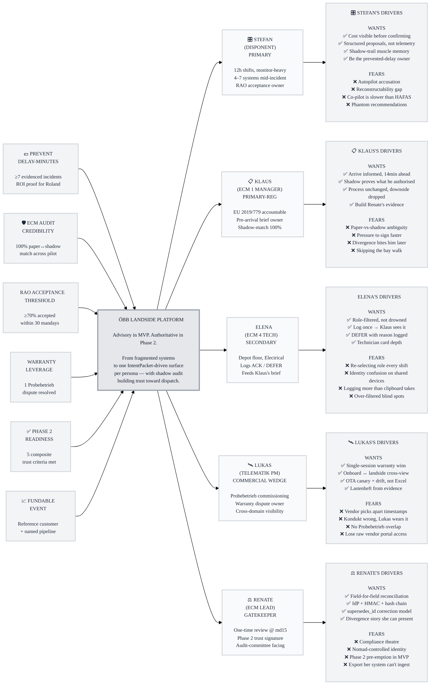

# Trigger Map Poster: ÖBB Landside Platform

> Visual overview connecting business goals to user psychology

**Created:** 2026-05-25
**Author:** Abbas Rizvi
**Methodology:** Based on Effect Mapping (Balic & Domingues), adapted for WDS framework
**Mode:** Suggest (synthesized from prd.md, commercial-model, role research, UX decisions, ECM sign-off spec)

---

## Strategic Documents

This is the visual overview. For detailed documentation, see:

- [`personas/01-disponent-stefan.md`](personas/01-disponent-stefan.md) — Fleet Manager
- [`personas/02-ecm-manager-klaus.md`](personas/02-ecm-manager-klaus.md) — ECM 1 Manager
- [`personas/03-ecm-4-technician-elena.md`](personas/03-ecm-4-technician-elena.md) — ECM 4 Technician
- [`personas/04-telematik-lukas.md`](personas/04-telematik-lukas.md) — Teil-Projektleitung Telematik
- [`personas/05-ecm-lead-renate.md`](personas/05-ecm-lead-renate.md) — ECM Lead (commercial gatekeeper)
- [`feature-impact-analysis.md`](feature-impact-analysis.md) — feature → driver mapping with impact scores

---

## Vision

**Make every landside decision — operational, regulatory, commissioning — visible at the moment it is made, traceable after, and trusted enough that the platform can eventually make some of them.**

The platform unifies ÖBB's fragmented landside surfaces (vendor portals, Power BI, ServiceNow, MS Project, paper sign-offs) around three personas under one IntentPacket stream. In MVP it closes the *information* gap. The 6-month pilot earns the five composite trust criteria. Phase 2 closes the *execution* gap — platform-mediated dispatch, authoritative ECM record — gated on that earned trust.

---

## Business Objectives

### Objective 1: Prove pilot ROI through prevented delay-minutes

- **Metric:** Counterfactual delay-minutes prevented, evidenced per incident
- **Target:** ≥7 incidents with documented counterfactual in pilot period; per ÖBB cost-per-delay-minute, platform pays for itself in under 2 months of full fleet deployment
- **Timeline:** Pilot manday 1 (end-Aug / Sept 2026) → readout at pilot manday 15 (ROI conversation with Roland + Martin)

### Objective 2: Establish ECM audit-trail credibility as Phase 2 evidence

- **Metric:** Shadow audit-trail match rate against paper sign-off (field-for-field)
- **Target:** 100% across the full pilot; ≤2 divergences per pilot week before Phase 2 readiness downgrades
- **Timeline:** From pilot manday 1; Renate Fischer review at manday 15; outside-auditor tabletop at mandays 20–25

### Objective 3: Hit recommendation acceptance threshold

- **Metric:** RAO acceptance rate (accepted / modified / rejected, with reasons catalogued)
- **Target:** ≥70% acceptance within first 30 pilot mandays (Roland-confirmed working assumption)
- **Timeline:** Acceptance rate updated weekly; gating Phase 2 trust composite

### Objective 4: Unlock vendor warranty leverage as commercial wedge

- **Metric:** Time-from-warranty-dispute-raised to evidence-packaged + vendor escalation cycles reduced
- **Target:** Single-session resolution for one Probebetrieb dispute during the pilot (gated on overlapping Probebetrieb cycle)
- **Timeline:** Opportunistic during pilot window — confirm overlap with Lukas's programme team pre-pilot

### Objective 5: Cross the Phase 2 readiness composite threshold

- **Metric:** Composite of (a) RAO acceptance rate ≥ threshold AND (b) shadow audit match 100% AND (c) Renate Fischer sign-off AND (d) outside-auditor tabletop verdict AND (e) zero unresolved pilot-kill triggers in final 30 days
- **Target:** All five required for full Phase 2 release; partial satisfaction triggers narrower Phase 2 scope
- **Timeline:** Phase 2 readiness recommendation within 6 months of pilot manday 1 (Feb/Mar 2027)

### Objective 6: Reference customer + fundable event

- **Metric:** Roland + Martin + Renate written endorsement; validated ROI numbers; named pipeline
- **Target:** Speedinvest / i5invest first-meeting-ready package by pilot end
- **Timeline:** Pilot manday 24 / Q1 2027

---

## Target Groups (Prioritized)

### 1. Stefan the Disponent (Fleet Manager) — **Primary**

**Priority Reasoning:** Highest-frequency user, the persona whose acceptance rate gates Phase 2, and the one carrying the ROI metric (prevented delay-minutes). Daily 12-hour shifts. Roland Ruisz is the real-world primary.

> Stefan runs a 12-hour rotating shift in the Wien operations centre. He's solution-focused, stress-resilient, accountable for fleet availability and cost. He's already monitor-heavy and digitally fluent — but switches between 4–7 systems mid-incident and that's where decisions get slow and traceability gets thin.

**Key Positive Drivers:**

- Make a redeployment call with cost consequence visible **before** confirming
- Be the operator whose shift produced the prevented-delay-minutes number Roland walks into the board meeting with
- Move from "translate raw telemetry across 5 systems" to "review a structured proposal and judge it"
- Build muscle memory for the gesture that becomes authoritative in Phase 2 — under low-stakes conditions

**Key Negative Drivers:**

- Recommend something that looked good on a card and broke something downstream (autopilot accusation)
- Get pulled into a regulatory dispute because his execution trail couldn't reconstruct who decided what
- A "co-pilot" that turns out to be a slower way to do what he already does in HAFAS
- Phantom recommendations during the pilot — recommendations that didn't fire, or fired in the wrong direction, eroding trust before Phase 2

---

### 2. Klaus the ECM 1 Manager — **Primary (regulatory)**

**Priority Reasoning:** The persona whose process is *not* changed in MVP but whose audit trail is the Phase 2 commercial wedge. Owns the pre-arrival review rate (>80% target) and the shadow-match rate (100% target).

> Klaus is accountable under EU Directive 2019/779. He arrives cold to a depot and his liability begins the moment he signs. Before the platform he asked the technician, read the paper fault log, made a judgment call, signed paper. The platform doesn't replace any of that — it gives him a structured brief 14 minutes before the vehicle docks and shadows his sign-off.

**Key Positive Drivers:**

- Arrive at the bay already knowing what failed, who resolved it, and what was deferred
- Have a digital shadow that proves what he actually authorised, if the paper is ever disputed
- Be the persona whose process didn't change but whose downside risk dropped
- Build the 100% shadow-match evidence that lets Renate sign off Phase 2

**Key Negative Drivers:**

- A digital sign-off that competes with the paper sign-off for "which is authoritative" — process ambiguity at the moment of regulatory clearance
- A platform that, by being present, gets him asked to sign off faster than he's comfortable
- A shadow record that says one thing while the paper says another, and the divergence comes back at him later
- Any pressure (real or perceived) to skip walking to the bay and confirming with the technician on site

---

### 3. Elena the ECM 4 Technician — **Secondary (operational)**

**Priority Reasoning:** Acknowledgement loop closer. Without Elena (and her Electrical / Mechanical / IT peers) logging resolutions, Klaus's pre-arrival brief is empty.

> Elena is on the depot floor — Electrical specialism. She fits parts, runs tests, deals with vendor portals when SNMP traps fire. Her current "logging" is a clipboard sheet and a phone call to whoever's covering ECM 1. She's used to her tools; she doesn't want a new screen unless it cuts steps.

**Key Positive Drivers:**

- A role-filtered view that doesn't drown her in brake alerts when she's working a camera firmware ticket
- Log an ACK once and have it propagate to Klaus's brief automatically — no phone call
- Defer something with a reason logged, instead of "yeah I told someone"
- Card depth tuned to her — fault code, port, last-known-good state, diagnostic step — not executive plain English

**Key Negative Drivers:**

- A shared depot device where she has to re-select her role every shift (friction → adoption drops)
- Being held accountable for an ACK she didn't make (identity confusion on shared devices)
- A platform that asks her to log structured detail she'd otherwise scribble on a clipboard in 3 seconds
- Card visibility rules that hide something she needed to see (over-filtered → blind spot)

---

### 4. Lukas the Teil-Projektleitung Telematik — **Primary (commercial wedge)**

**Priority Reasoning:** The non-obvious-to-competitors persona. Owns the vendor warranty leverage capability that closes the unit-economics gap for fleet rollout pricing.

> Lukas manages a sub-project inside the larger Cityjet DOSTO Neu programme. Before each new fleet enters service he runs Probebetrieb — a commissioning gauntlet where a single hardware telematics failure can freeze formal sign-off. Vendors push back. Disputes get bureaucratic. Lukas spends days pulling logs and writing CR rebuttals. He's not in operations — he's in delivery — and he's invisible to most "fleet management" pitches.

**Key Positive Drivers:**

- Resolve a vendor dispute in a single session with timestamp-correlated evidence the platform packaged for him
- Have the cross-domain visibility (onboard memory utilisation vs. landside service P99 latency in one view) that competitor dashboards can't produce
- Monitor OTA rollouts with canary + drift detection, not Excel
- Multi-vehicle Lastenheft procurement-spec export generated from operational evidence, not written from scratch

**Key Negative Drivers:**

- A warranty-evidence package the vendor's lawyer can pick apart on a timestamp ambiguity
- A platform that surfaces "Kondukt thinks it's the bus controller" and is wrong — Lukas loses credibility, not the platform
- A Probebetrieb window that ends before the platform has been validated against it (Journey 6 is unsupported during pilot)
- Loss of access to vendor-raw diagnostic portals — Lukas trusts those, the platform is layered on top, not a replacement

---

### 5. Renate the ECM Lead (Head of Vehicle Maintenance, ÖBB TS) — **Commercial Gatekeeper**

**Priority Reasoning:** Not a user — a one-time reviewer at pilot manday 15. Her endorsement is one of the five Phase 2 trust criteria. Without her, Phase 2 narrows or doesn't happen.

> Renate is the ECM-accountable executive. She was not in the pilot planning meeting. Martin Lerch brings her in. Her question is not "does it work?" — it's "is this audit-trail capability sound enough that I would be willing, after pilot end, to make it the authoritative ECM record?"

**Key Positive Drivers:**

- Field-for-field paper-to-shadow reconciliation she can verify with her own eyes on Unit 4722
- IdP-bound identity, HMAC + hash-chain tamper evidence, append-only enforcement at DB level — engineering rigour she can stake her name on
- A clear correction model (`supersedes_id`) that doesn't mutate the past
- A divergence-handling story she can present to her audit committee

**Key Negative Drivers:**

- A platform that *looks* compliant but ducks the supersedes / correction question
- Audit trail tied to a Nomad-controlled identity rather than ÖBB's IdP (sovereignty concern)
- Any pre-emption of Phase 2 in MVP scope — anything that smells like "we're already the record of authority, you just haven't noticed"
- Export format that her documentation system can't ingest at fleet rollout

---

## Trigger Map Visualization

---

## Design Focus Statement

**The MVP succeeds when Stefan trusts the recommendation enough to act on it, Klaus's shadow record matches his paper every time, and Renate signs off on the audit-trail capability.** Everything else — Elena's ACK loop, Lukas's warranty wins, the Phase 2 narrative — is downstream of those three. Design every surface to earn those three signals.

**Primary Design Target:** Stefan (Disponent) — highest-frequency user, RAO acceptance owner, ROI carrier.

**Must Address (no design choice may regress these):**

- Cost consequence visible **before** confirming any redeployment (Stefan)
- Recommendation framed as proposal not command — readable card, step-by-step execution guide, "Mark executed" not "Execute" (Stefan)
- Pre-arrival brief opens 14 minutes before HAFAS scheduled arrival, role-filtered, no role hidden by accident (Klaus + Elena)
- 3-second hold → 5-second countdown → atomic write gesture for shadow sign-off — preserved across MVP and Phase 2 as the trust muscle (Klaus)
- IdP-bound identity, HMAC, hash chain, `supersedes_id` correction visible in audit export (Renate)
- Divergence between paper and shadow surfaces within 24h, never silently ignored (Renate)

**Should Address (high value, no first-MVP blocker):**

- Crisis entry state (full-width chat pre-seeded) for Stefan — covered in PRD, design needs to honour the entry state without breaking the 70/30 triage default
- Three-zone Telematics control board interaction binding (Zone 1 selection → Zone 2 topology → Zone 3 RAO) for Lukas
- Role persistence model split: session-only on shared depot device, stored on personal phone (Elena)
- Kondukt confidence visual grammar (three-tier) consistent across all RAO surfaces — Stefan + Lukas

---

## Cross-Group Patterns

### Shared Drivers

- **All five personas fear the platform overstating its authority** — Stefan fears autopilot accusations, Klaus fears paper-vs-shadow ambiguity, Renate fears Phase 2 pre-emption, Lukas fears wearing Kondukt's wrong call, Elena fears being held accountable for an ACK she didn't make. **Implication:** advisory-only must be visible in the UI grammar, not just stated in the PRD. The platform's voice is "I propose, you decide, I record."
- **All four operational personas (Stefan, Klaus, Elena, Lukas) want continuity with the systems they already trust** — HAFAS for Stefan, paper for Klaus, clipboard ergonomics for Elena, raw vendor portals for Lukas. **Implication:** the platform layers on top, doesn't displace. Every workflow must answer "what do I do in the system I trust?" — that's the step-by-step in the RAO.
- **All five want traceability, not just records** — every persona's negative driver includes some version of "and then it comes back at me." **Implication:** every audit surface answers *who decided, when, what action, what outcome* — not just "an event happened."

### Unique Drivers

- **Stefan:** the only persona whose acceptance behaviour is a *measured composite* (accept / modify / reject) and whose modification rate signals trust-but-not-yet-dispatch. Modification UX matters as much as accept UX.
- **Klaus:** the only persona whose process *doesn't change* in MVP. Surfaces must not pressure him to sign faster than his paper process supports.
- **Elena:** the only persona working on a shared device in some contexts and a personal device in others. Identity model must support both without confusion.
- **Lukas:** the only persona whose primary value-extraction is *vendor-facing*, not ÖBB-internal. The warranty evidence packet has to survive a vendor lawyer reading it.
- **Renate:** the only "persona" who is a one-time reviewer, not a daily user. Her surface is the audit export and the reconciliation queue — not the operational dashboards.

### Potential Tensions

- **Stefan ↔ Renate** — Stefan wants the platform to feel like a co-pilot accelerating his decision; Renate wants it to feel like a record-keeper that has not yet earned authority. **Resolution:** Stefan's "Mark executed" gesture writes Renate's audit row. The same surface satisfies both readings — proposal for Stefan, record for Renate.
- **Klaus ↔ Stefan** — Klaus's process is paper-first; Stefan's is platform-first. If the same `ecm_signoff_events` shadow row is the output of two different gestures (Klaus's hold-to-record vs Stefan's "Mark executed"), the schema and UI grammar must make the source explicit so Renate's reconciliation queue can audit each correctly.
- **Elena ↔ Klaus** — Elena's role-filtered view hides things by design (the brake alert isn't shown to IT). Klaus's view shows everything. If a fault is mis-tagged for `role_relevance`, Elena is blind and Klaus is overwhelmed. **Resolution:** the `role_relevance` field on cards needs an ECM-Manager-signed-off taxonomy (open decision Q1 in `ux-decisions-2026-05-23.md` — sort order per role needs ECM Manager sign-off).
- **Lukas ↔ MVP scope** — Lukas's primary value moment (Journey 6) depends on an overlapping Probebetrieb cycle. If none overlaps the pilot, Lukas is a Phase 2 demo persona. **Resolution:** pre-pilot gate confirms overlap with Lukas's programme team; if no overlap, Telematics surfaces ship and warranty triage is documented as a post-pilot story.

---

## Next Steps

This Trigger Map provides the strategic reference for downstream phases:

- [ ] **Review per-persona detail files** — `personas/01–05`
- [ ] **Review feature impact analysis** — `feature-impact-analysis.md`
- [ ] **Phase 3: UX Scenarios** — Freya translates each Must-Address driver into scenario micro-steps
- [ ] **Validate with Roland Ruisz** — primary-persona driver list (Stefan + Lukas dual-hat) confirmed by the real-world equivalent
- [ ] **Validate with Renate Fischer** — gatekeeper persona driver list verified before pilot manday 15 review

---

_Generated with Whiteport Design Studio framework_
_Trigger Mapping methodology credits: Effect Mapping by Mijo Balic & Ingrid Domingues (inUse), adapted with negative driving forces_
